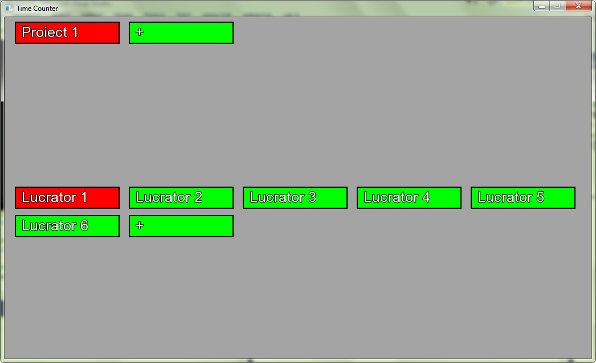

This is a timekeeping program, made in C++, using SFML libraries.

- On top are the active projects and on the bottom are the workers.
- By right clicking a field, you can edit it. After edit, when Enter key is pressed, a new field is added (project or worker).
- By left-clicking a project, you can see the active workers for that project and the field will color red.
- To switch between project, you must exit the active project (by left click) and then enter another.
- If a worker is left-clicked, time will start for that project and the field will color red.
- To stop the time, another left click must be made on the worker.
- A worker cannot work on two projects in the same time. If a worker is active on one project, when activate it on some other
project, first the time will stop and then will be active, so two left clicks are required.
- Time a worker was active on a project is automatically written on an .XLS file.
